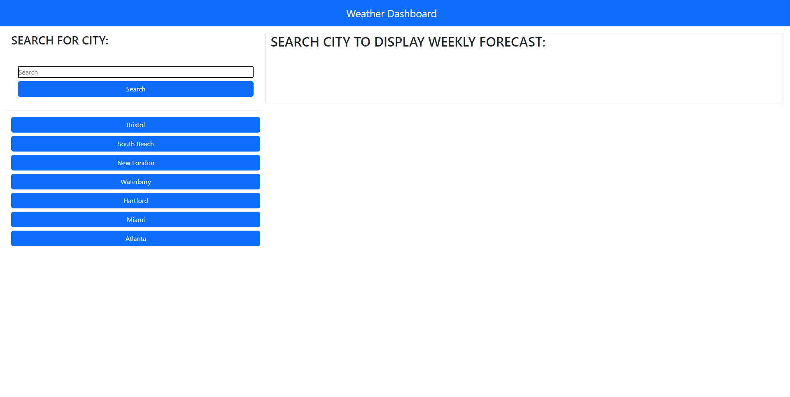
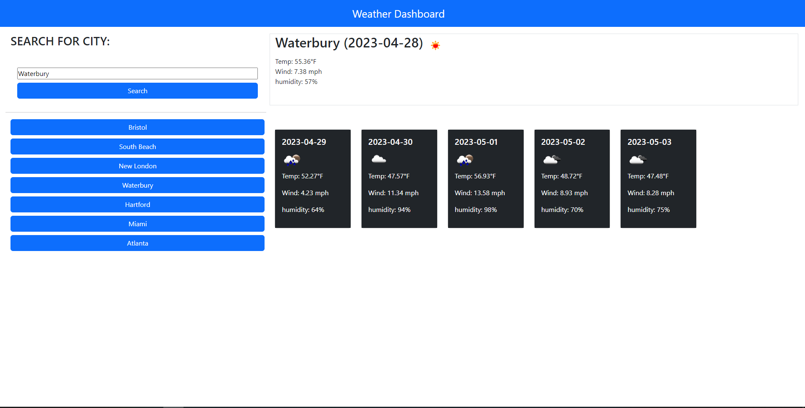
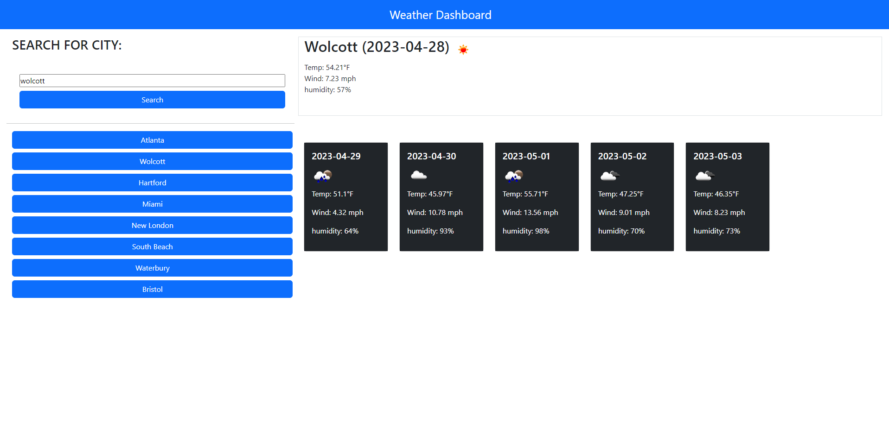

# Daily Schedule App

## Author

Devin Nunez

Email: devv-nunn@gmail.com

git: https://github.com/devv-nunn

## Description

In this project we will focus on making a weather dashboard. This application will feature local storage in order to save a history of searched cities. Api calls will be made to get weather data from openWeather api. We will make Api calls when user types city in and selects search or when user selects one of the buttons that represent a past search. 

-In this project we learned the implementation of local storage for data storage and retrieval and the use of Api's to get live data.

## Table of Contents
N/a

## Installation

- Nothing needed be installed other than vs code to run application.

- Clone the following repository and run index.html.

## Usage

To use this weather dashboard open up the page and search for a city. If you have searched for a city prior to this use of the wather dashboard the city you previously searched up will appear as a quick search button that will display the weather of that city once selected.

## Deployment

Repo: https://github.com/devv-nunn/weatherApp

GitPage: https://devv-nunn.github.io/weatherApp/

# Tech Stack

- HTML 
- CSS
- JavaScript
- JQuery

## Credits

N/a

## License

MIT License.